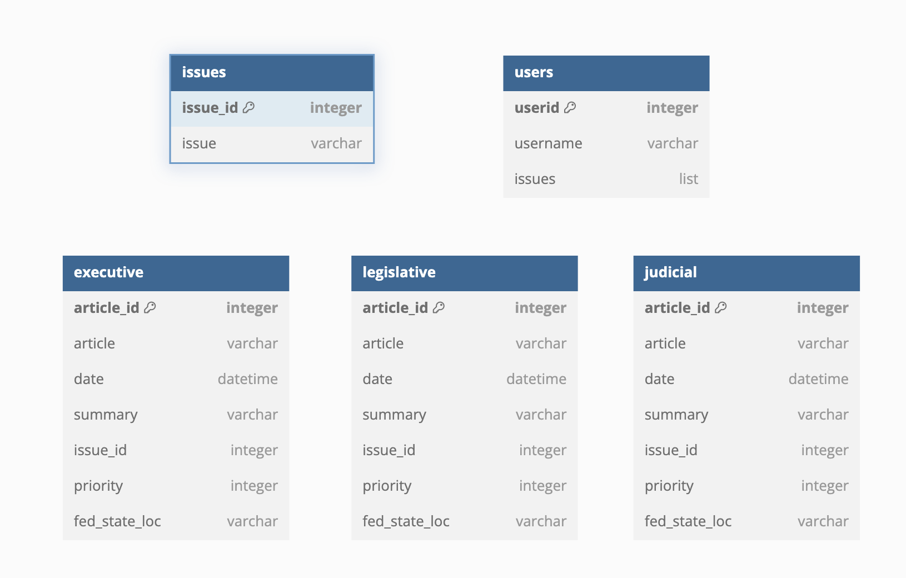

# hoohacks2025-wmjj

# HooHacks!

Repository for our HooHacks Project, Spring 2025

# Team Members:

- William Loving (wfl9zy)
- Mitch Mitchell (jbm8efn)
- James Sweat (jes9hd)
- Jackson Miskill (jcm4bsq)

# Directory Structure:

<pre>
├── Database.png
├── LICENSE
├── README.md
├── project
│   ├── 01-frontend
│   │   ├── Dockerfile.apache
│   │   ├── README.md
│   │   ├── apache
│   │   │   └── custom-conf.conf
│   │   └── public
│   │       ├── favicon.ico
│   │       ├── images
│   │       │   └── favicon.png
│   │       ├── index.html
│   │       ├── issue.html
│   │       └── js
│   │           ├── api.js
│   │           └── config.js
│   ├── 02-backend
│   │   ├── Dockerfile.flask
│   │   ├── README.md
│   │   ├── api
│   │   │   ├── app.py
│   │   │   ├── llm.py
│   │   │   └── sandbox.ipynb
│   │   └── requirements.txt
│   ├── 03-db
│   │   ├── Dockerfile.mongo
│   │   ├── README.md
│   │   ├── data
│   │   │   ├── executive_orders.csv
│   │   │   ├── issues.csv
│   │   │   └── perigon_us_politics_2025.json
│   │   ├── db_populate
│   │   │   ├── articles.py
│   │   │   ├── embedding.py
│   │   │   ├── executive_orders.py
│   │   │   ├── issues.py
│   │   │   └── sandbox.ipynb
│   │   └── mongo-init
│   │       └── init_mongo.js
│   ├── 04-python-scripts
│   │   ├── exec-dev
│   │   │   ├── orders_manip.py
│   │   │   ├── orders_scrape.py
│   │   │   └── test.py
│   │   └── news-dev
│   │       └── get_orders.py
│   ├── docker-compose.yml
│   └── project.dbml
└── sources.txt

</pre>

# Database Design:

# API Websites:

- [legislative](api.congress.gov)
- [judicial](wip)
- [executive](https://www.whitehouse.gov/presidential-actions/)