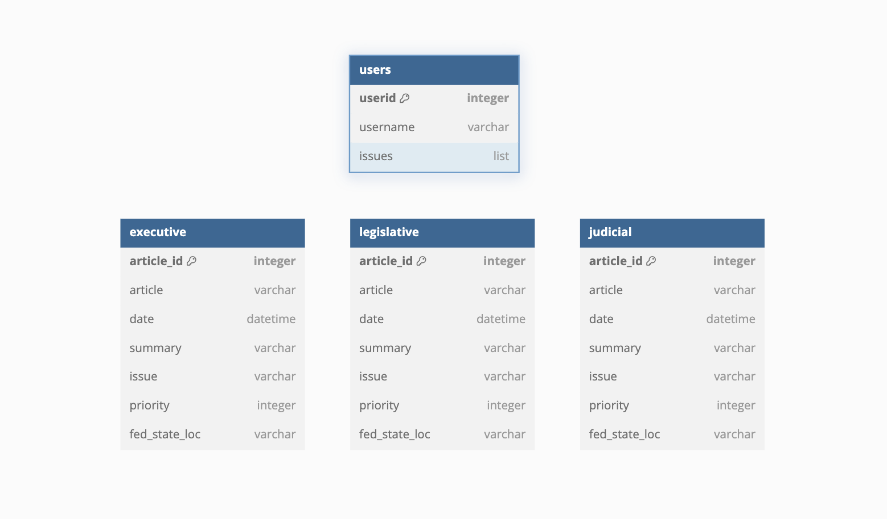

# hoohacks2025-wmjj

# HooHacks!

Repository for our HooHacks Project, Spring 2025

# Team Members:

- William Loving (wfl9zy)
- Mitch Mitchell (jbm8efn)
- James Sweat (jes9hd)
- Jackson Miskill (jcm4bsq)

# Directory Structure:

<pre>
├── LICENSE
├── README.md
├── project
│   ├── 01-frontend
│   │   ├── Dockerfile.apache
│   │   ├── apache
│   │   │   └── custom-conf.conf
│   │   └── public
│   │       ├── images
│   │       │   └── favicon.png
│   │       └── index.html
│   ├── 02-backend
│   │   ├── Dockerfile.flask
│   │   ├── api
│   │   │   └── app.py
│   │   ├── llm
│   │   └── requirements.txt
│   ├── 03-db
│   │   ├── Dockerfile.mongo
│   │   └── db-init
│   └── docker-compose.yml
└── sources.txt
</pre>

# Database Design:

# Task Breakup: 

- William : DevOps, Frontend, Infra-Setup
- James: API work, LLM Integration
- Mitch: API Work, Database Population
- Jackson: ER-Diagram Setup